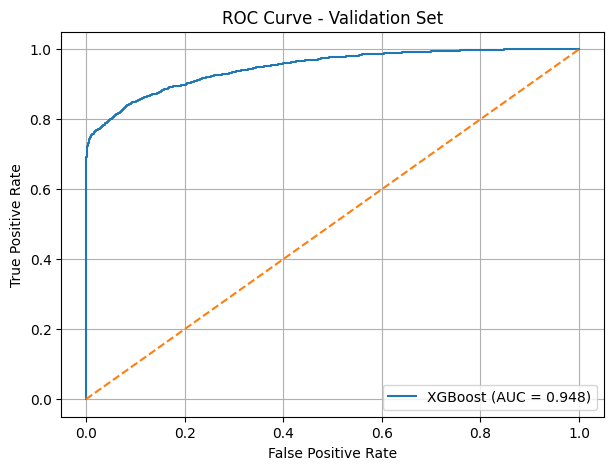
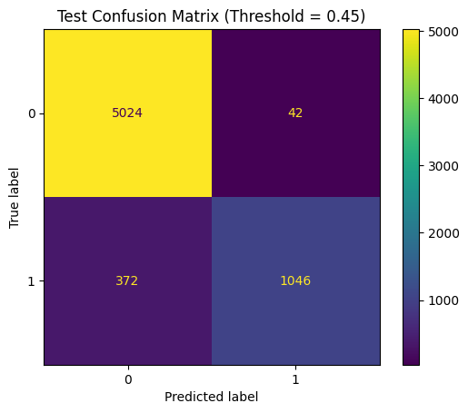
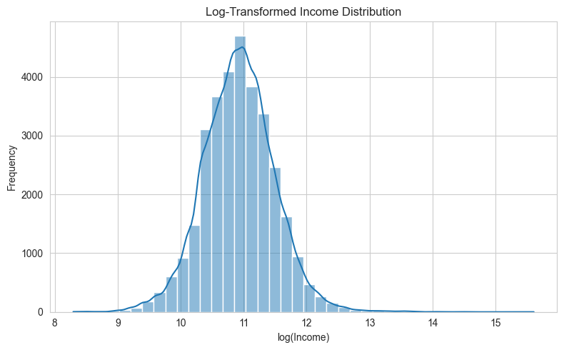
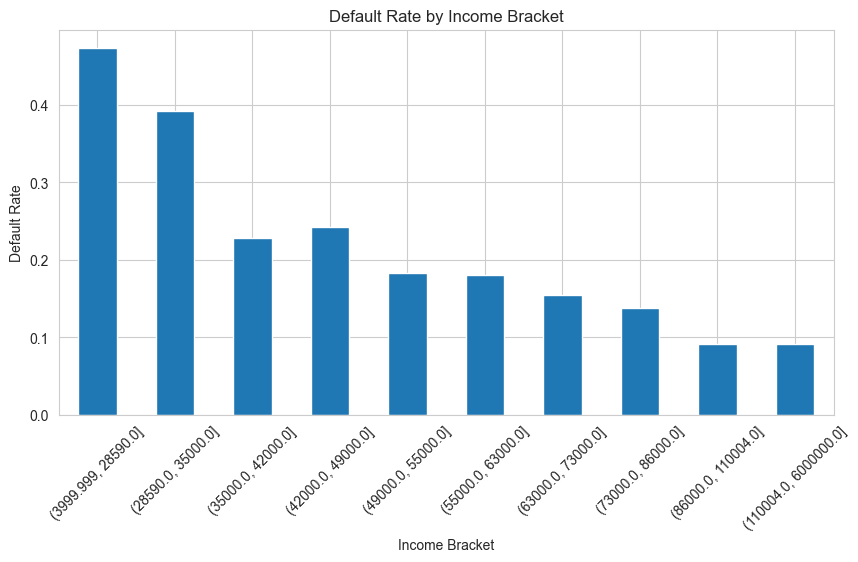
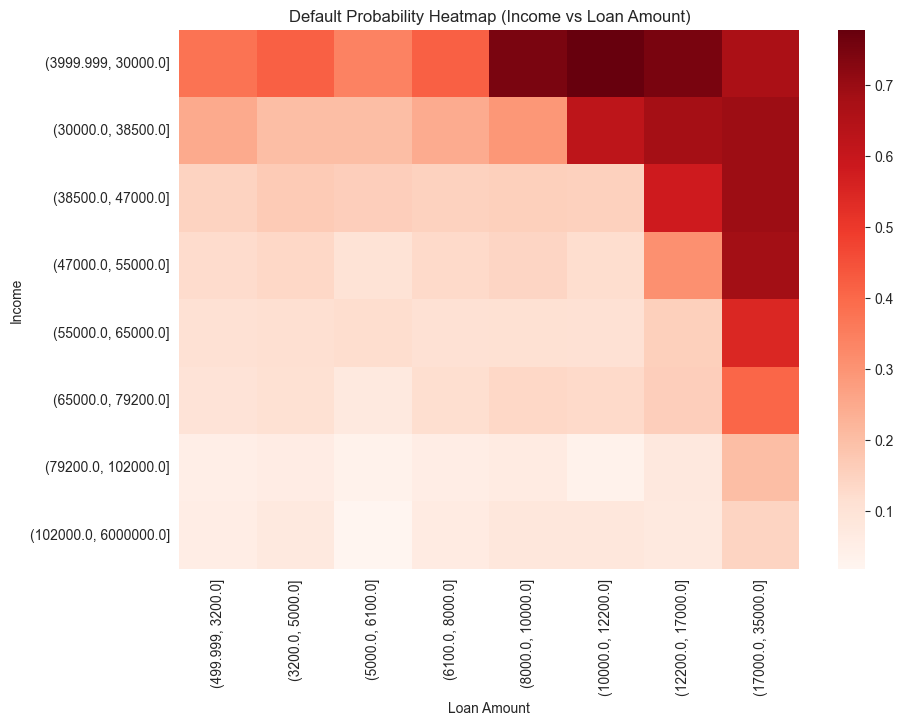
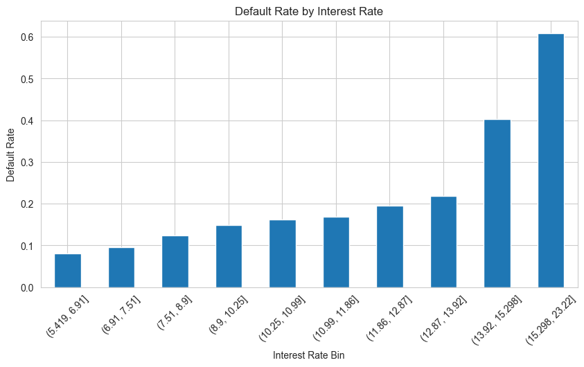

# CS506-Project
# Credit Risk Detection

## Youtube Link 

## Problem statement
Lending money is a core part of banks and financial institutions, but it comes with inherent risk. Every time a loan is issued, there is a possibility that the borrower may fail to repay it. These events, known as loan defaults, can lead to substantial financial losses if not managed properly. Rather than manually making credit decisions on metrics such as income, employment, and credit history, we want to make a model that can automate this process. This is especially needed as the volume of loan applications increases and data gets more detailed.

## Description
The project will process a credit risk data set which will have details such as credit risk history, income, home ownership, employment, etc as well as an outcome if they defaulted or not. We will use this data set to train a model to determine the probability of a client defaulting on a loan. We will need to keep some of the data for testing purposes where we measure the accuracy of the model.

**Note:** We do recognize that people come from different backgrounds in their lives and putting people all into one bucket of credit risk detection may not be morally right which is why we chose to predict the probability of them defaulting rather than segregating them in a hard category.

## Goal
The primary goal of this project is to build and evaluate a supervised machine learning model that predicts the probability that a loan applicant will default on a loan based on their historical credit, employment and financial data.

Essentially, the project aims to:
- Train a classification model using labeled credit risk data.  
- Use applicants' financial, employment and credit history features to predict loan default outcomes.  
- Achieve reliable predictive performance measures using ROC, precision, recall and F1 score on a test set  
- Identify and analyze the most influential features contributing to default risk.  

**Note:** Although the model produces a probability, a threshold can be applied by the user to convert the output into a binary decision for evaluation purposes. This is useful as different Banks and Financial Instituions will have different thresholds on probabilities of defaulting e.g. one Bank might have a probability greater than 0.6 as a default risk whereas others may have it at 0.8 or higher. 

## How to Build and Run the Code

**Step 1** : Install all dependencies and build the environment\
`make install`

**Step 2** : Run the full pipeline\
`make run`

**Step 3** : Run tests\
`make test`

**Main script** 
`final_code.py`

## Primary Dataset
The primary dataset used for this project is the Kaggle dataset - Credit Risk Dataset. This dataset contains historical loan records for individual applicants and is well suited for our problem statement as well as for supervised learning tasks.

https://www.kaggle.com/datasets/laotse/credit-risk-dataset

## Data Description
The data gives us access to borrowers' financial background, employment status and loan characteristics. The key features are as follows:

- **Income**: Applicants reported annual income  
- **Employment length**: Number of years the applicant has been employed  
- **Home ownership status**: Ownership category which includes if the person rents, owns or has put it on mortgage  
- **Loan Information**: Loan amount, interest rate and loan purpose  
- **Credit history indicators**: Measures related to applicants past credit behavior and risk  
- **Loan default outcome**: A binary label indicating whether the borrower has defaulted on the loan  

The target variable is the loan default outcome.

## Data Collection Method
The dataset would be downloaded from Kaggle and stored locally within the project repository.  
No data will be collected through surveys, scraping or APIs.

## Data Cleaning & Preprocessing
The dataset was cleaned and transformed to ensure consistency, reliability, and suitability for model training.

**Handling Missing Values**
* Checked for null values across all features.
* Numerical features were imputed using median values to reduce sensitivity to outliers.
* Categorical features were filled using the most frequent category.

**Removing Inconsistent and Invalid Data**
* Removed duplicate records to avoid bias.
* Verified ranges for numerical features (e.g., age, income) and filtered unrealistic values.
* Standardized categorical labels to ensure consistency.

**Encoding Categorical Variables**
* Applied one-hot encoding for nominal features (e.g., loan intent, home ownership).
* Used label encoding where appropriate for ordinal features.
* Ensured all features were converted to numeric format for model compatibility.

**Feature Scaling**
* Applied normalization/standardization to numerical features where required
* Ensured features with large ranges (e.g., income, loan amount) did not dominate model learning

**Train-Test Split** 
* Split dataset into training and testing sets to ensure unbiased evaluation (80-20).
* Maintained consistent preprocessing across both sets.

**Pipeline Consistency**
* All preprocessing steps were implemented in code to ensure reproducibility
* Same transformations applied during training and inference

## Feature Extraction
The target variable for this project is `loan_status`, which indicates whether a borrower defaulted on a loan. To prepare the data for modeling, `loan_status` was separated from the input features so the models could learn from borrower, loan, and credit-related attributes.

The input features include both numerical and categorical variables.

**Numerical features include:**
- `person_age`: borrower age  
- `person_income`: borrower annual income  
- `person_emp_length`: employment length  
- `loan_amnt`: requested loan amount  
- `loan_int_rate`: loan interest rate  
- `loan_percent_income`: loan amount as a percentage of income  
- `cb_person_cred_hist_length`: length of credit history  

**Categorical features include:**
- `person_home_ownership`: home ownership status  
- `loan_intent`: purpose of the loan  
- `loan_grade`: assigned loan grade  
- `cb_person_default_on_file`: previous default indicator  

Numerical features were processed using imputation and scaling, while categorical features were converted into model-readable form using one-hot encoding. This allowed the models to use both quantitative financial information and categorical borrower characteristics.

These features are appropriate for credit risk prediction because they capture the main factors that influence loan default: repayment capacity, loan burden, employment stability, credit history, previous default behavior, and loan purpose.

## Model Training & Evaluation

### Training Procedure
The dataset was preprocessed using a consistent pipeline that handled missing values, encoded categorical variables, and scaled numerical features. The target variable `loan_status` was separated from the feature set.

The data was split into training and testing sets to ensure unbiased evaluation. For the XGBoost model, an additional validation approach was used through threshold tuning on predicted probabilities.

The model was trained using the following configuration:\
n_estimators = 300\
max_depth = 6\
learning_rate = 0.05\
subsample = 0.9\
colsample_bytree = 0.9

These parameters were selected to balance model complexity, generalization, and training efficiency.

### Model Choice

Multiple models were explored including Logistic Regression, Decision Tree, Random Forest, and GMM. The final model selected was XGBoost due to its superior performance.

XGBoost is well-suited for this problem because it captures nonlinear relationships, handles tabular data effectively, and includes built-in regularization to reduce overfitting.

### Evaluation Strategy

Model performance was evaluated using:

- Accuracy  
- Precision  
- Recall  
- F1 Score  
- ROC-AUC  
- Confusion Matrix  

Threshold tuning was performed by testing values from 0.1 to 0.9 and selecting the threshold that maximized F1 score. This improves performance in imbalanced classification settings.

### Results Summary

XGBoost achieved the best overall performance among all models. Threshold tuning improved the balance between precision and recall, leading to stronger F1 score and more reliable predictions.

### Model Comparison

| Model                | Accuracy | Precision | Recall | F1 Score | ROC-AUC |
|---------------------|----------|----------|--------|----------|---------|
| Logistic Regression | 0.820    | 0.560    | 0.780  | 0.660    | 0.878   |
| Decision Tree       | 0.890    | 0.760    | 0.730  | 0.750    | 0.878   |
| Random Forest       | 0.933    | 0.977    | 0.712  | 0.823    | 0.932   |
| XGBoost             | 0.938    | 0.964    | 0.745  | **0.841**| ~0.93   |

## Visualizations
### Income Distribution
A log transformation was applied to income to reduce skewness and better understand its distribution.

- The distribution becomes approximately normal after transformation  
- Most borrowers fall within a mid-income range  
- Extreme high-income values are compressed, reducing outlier impact  

Log transformation improves model stability and ensures income does not dominate learning.

### Default Rate vs Loan-to-Income Ratio
- Default rate increases steadily as loan-to-income ratio increases  
- Borrowers with high loan burden relative to income show significantly higher risk  
- Sharp increase in default rates at higher ratio bins  

Loan-to-income ratio is a strong predictor of default risk.

### Default Probability Heatmap (Income vs Loan Amount)
- High default probabilities are concentrated in:
`Low income + high loan amount regions`  
- Low default probabilities occur in:
`High income + low loan amount regions` 

Default risk is driven by the interaction between income and loan size, not individual features alone.

### Default Rate vs Interest Rate

- Default rate increases as interest rate increases  
- Higher interest rates correlate with higher borrower risk  
- Sharp rise in default probability at upper interest rate bins  

Interest rate acts as a proxy for underlying credit risk.

### Overall Conclusion from Visualizations

- Default risk is primarily driven by:
  - Loan burden (loan-to-income ratio)  
  - Interest rate  
  - Interaction between income and loan amount  

These patterns justify the use of XGBoost, as it effectively captures nonlinear relationships and feature interactions observed in the data.

## Results

The final XGBoost model achieved strong performance on the test set after threshold tuning.

Using an optimized classification threshold (0.45), the model achieved a balanced trade-off between precision and recall, resulting in a high F1 score and robust overall performance. This confirms that threshold tuning significantly improves performance in imbalanced classification settings such as credit risk prediction.

The model also captures nonlinear relationships between borrower features (income, loan amount, interest rate, and credit history), leading to more accurate predictions compared to baseline models.

### Output Artifacts

The following outputs are generated for analysis and reproducibility:

- `outputs/XGBoost_test_predictions.csv` → final predictions with probabilities  
- `outputs/xgboost_feature_importance.csv` → ranked feature importance  
- `outputs/xgboost_feature_importance.png` → visualization of top features  
- `outputs/xgboost_roc_curve.png` → ROC curve for model performance  
- `outputs/xgboost_precision_recall_curve.png` → precision-recall trade-off  
- `outputs/xgboost_validation_confusion_matrix.png` → validation performance  
- `outputs/xgboost_test_confusion_matrix.png` → final test evaluation  

These outputs allow both quantitative evaluation and visual inspection of model behavior.

## Testing

A lightweight test suite is implemented using `pytest` to ensure correctness of key components.

### Tests Included

- Dataset loading validation  
- Verification of target column existence (`loan_status`)  
- Binary classification check for target variable  
- Duplicate removal validation  
- Train/validation/test split correctness  
- Feature type detection (numerical vs categorical)  

### Run Tests

`make test
`

This ensures the data pipeline and preprocessing steps remain reliable and reproducible.
## GitHub Workflow

A GitHub Actions workflow is configured at:

`.github/workflows/tests.yml`

### Pipeline Steps
- Install project dependencies  
- Run automated test suite using `pytest`  

### Trigger Conditions
- Push to repository  
- Pull requests  

This ensures that every code change is automatically validated, maintaining code quality and preventing regressions.

---

## System Architecture

The project is structured as a reproducible end-to-end pipeline:

- `final_code.py` → executes the full workflow (data → preprocessing → model → evaluation)  
- `Makefile` → standardizes setup, execution, and testing commands  
- `tests/` → contains automated validation scripts  
- `outputs/` → stores all generated results and visualizations  

This modular structure ensures that the entire pipeline can be executed and verified with minimal effort.

---

## Conclusion

This project implements a complete data science pipeline for credit risk prediction.

Key components include:

- Data cleaning and preprocessing  
- Feature extraction and transformation  
- Training multiple machine learning models  
- Selection of XGBoost as the final model  
- Threshold tuning to improve classification performance  
- Evaluation using multiple metrics  
- Visualization of data patterns and model behavior  
- Automated testing and CI integration  

The final XGBoost model effectively predicts loan default risk using structured financial data and demonstrates strong performance on unseen test data.

## Project Timeline

| Week   | Activities |
|--------|-----------|
| Week 1 | Setup project, define problem, identify success metrics, research credit risk modeling, choose tech stack |
| Week 2 | Explore dataset, understand features, identify relationships and anomalies |
| Week 3 | Split dataset (train/validation/test), clean data, handle missing values, finalize features |
| Week 4 | Build initial model, evaluate performance, document results |
| Week 5 | Improve model, experiment with new models, tune hyperparameters |
| Week 6 | Compare models, select best performing model |
| Week 7 | Evaluate final model on test set, analyze errors, assess fairness and bias |
| Week 8 | Finalize report, prepare presentation, clean and document code |

